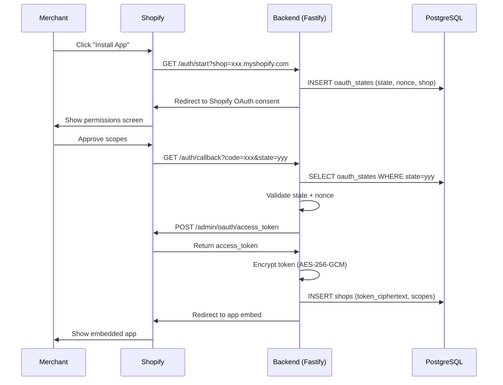
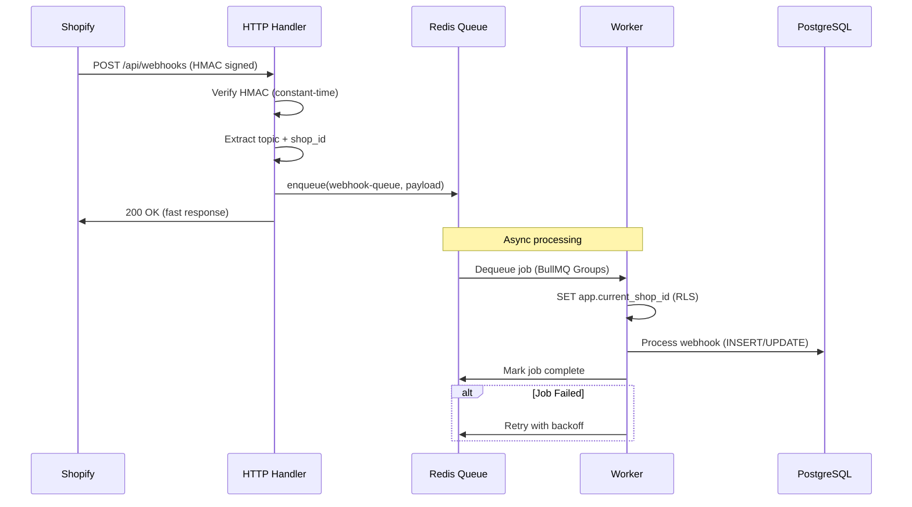
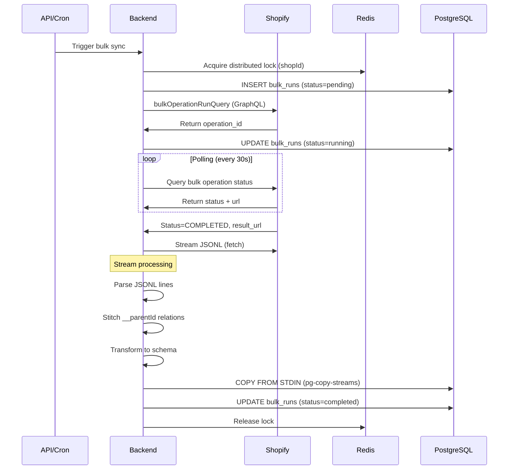
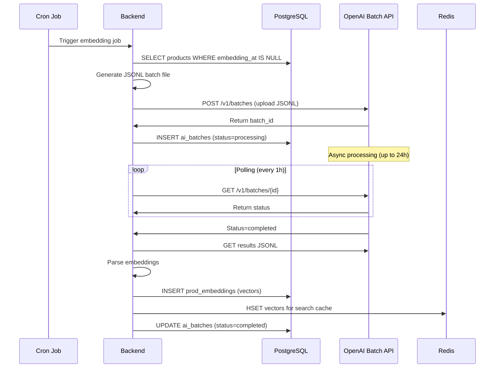
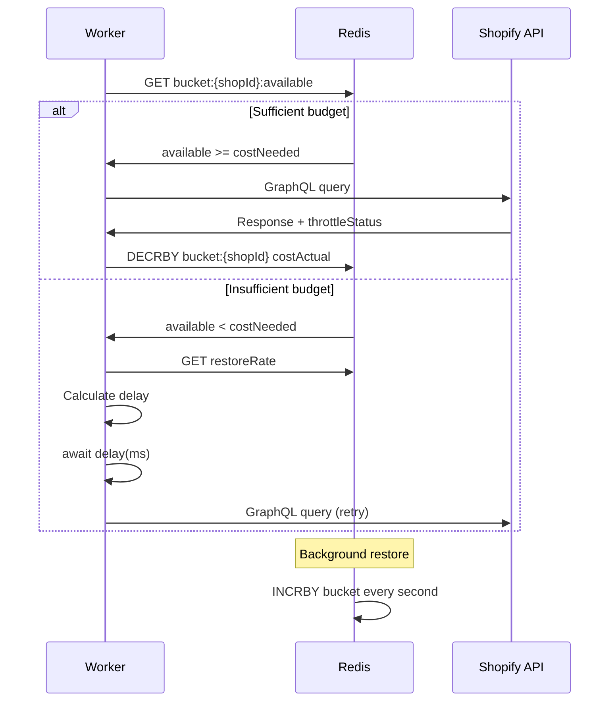
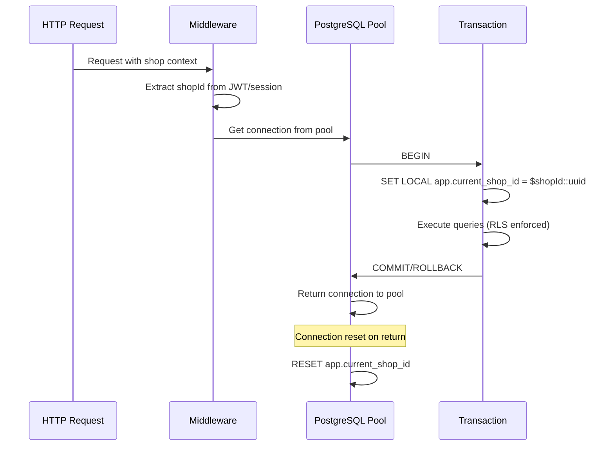

# Sequence Diagrams - Neanelu Shopify Enterprise

> **Format:** Mermaid | **Version:** 1.0 | **Last Updated:** 2025-12-26

---

## 1. OAuth Installation Flow

---

## 2. Webhook Processing Pipeline

---

## 3. Bulk Operations Pipeline (1M+ Products)

---

## 4. AI Embedding Batch Flow

---

## 5. Rate Limiting Flow (Shopify GraphQL)

---

## 6. Multi-tenant RLS Context Flow

---

## Legend

| Symbol | Meaning |
| ------ | ------- |
| ─────► | Synchronous call |
| ─ ─ ─► | Async/background |
| █████ | Database storage |
| ░░░░░ | Cache/queue |
