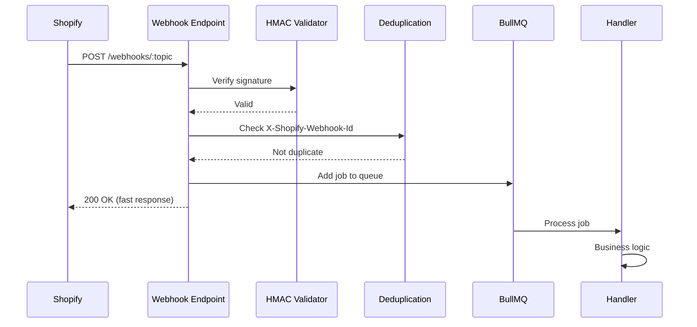

# Webhook Topics Reference - NEANELU Shopify Manager

> **Versiune:** 1.0 | **API Version:** 2025-10 | **Data:** 2025-12-26

---

## Registration

Webhook-urile sunt înregistrate automat la instalarea aplicației. Configurația se află în:

- `apps/backend-worker/src/webhooks/registry.ts`

---

## Supported Topics

### Products

| Topic              | Priority | Queue          | Handler               | Description        |
| ------------------ | -------- | -------------- | --------------------- | ------------------ |
| `products/create`  | Normal   | sync.products  | ProductCreatedHandler | Produs nou creat   |
| `products/update`  | Normal   | sync.products  | ProductUpdatedHandler | Produs modificat   |
| `products/delete`  | High     | sync.products  | ProductDeletedHandler | Produs șters       |

**Payload Sample (products/update):**

```json
{
  "id": 123456789,
  "title": "Product Name",
  "body_html": "<p>Description</p>",
  "vendor": "Vendor Name",
  "product_type": "Category",
  "handle": "product-handle",
  "status": "active",
  "variants": [...],
  "options": [...],
  "images": [...],
  "updated_at": "2025-12-26T10:00:00Z"
}
```

---

### Collections

| Topic                 | Priority | Queue             | Handler                   | Description          |
| --------------------- | -------- | ----------------- | ------------------------- | -------------------- |
| `collections/create`  | Normal   | sync.collections  | CollectionCreatedHandler  | Colecție nouă        |
| `collections/update`  | Normal   | sync.collections  | CollectionUpdatedHandler  | Colecție modificată  |
| `collections/delete`  | Normal   | sync.collections  | CollectionDeletedHandler  | Colecție ștearsă     |

---

### Inventory

| Topic                        | Priority | Queue           | Handler                      | Description            |
| ---------------------------- | -------- | --------------- | ---------------------------- | ---------------------- |
| `inventory_levels/update`    | Normal   | sync.inventory  | InventoryUpdatedHandler      | Stoc modificat         |
| `inventory_levels/connect`   | Low      | sync.inventory  | InventoryConnectedHandler    | Locație conectată      |
| `inventory_levels/disconnect`| Low      | sync.inventory  | InventoryDisconnectedHandler | Locație deconectată    |

---

### Orders

| Topic              | Priority | Queue        | Handler               | Description          |
| ------------------ | -------- | ------------ | --------------------- | -------------------- |
| `orders/create`    | High     | sync.orders  | OrderCreatedHandler   | Comandă nouă         |
| `orders/updated`   | Normal   | sync.orders  | OrderUpdatedHandler   | Comandă modificată   |
| `orders/cancelled` | High     | sync.orders  | OrderCancelledHandler | Comandă anulată      |
| `orders/fulfilled` | Normal   | sync.orders  | OrderFulfilledHandler | Comandă livrată      |

---

### App Lifecycle

| Topic             | Priority | Queue          | Handler               | Description                 |
| ----------------- | -------- | -------------- | --------------------- | --------------------------- |
| `app/uninstalled` | Critical | app.lifecycle  | AppUninstalledHandler | App dezinstalată - cleanup  |
| `shop/update`     | Normal   | app.lifecycle  | ShopUpdatedHandler    | Shop info modificat         |

**CRITICAL: `app/uninstalled`**

- Trebuie să proceseze IMEDIAT
- Șterge toate datele shop-ului (GDPR compliance)
- Invalidează tokens
- Cleanup din toate cozile

---

### Customers (Extended - If Scopes Permit)

| Topic               | Priority | Queue           | Handler                | Description           |
| ------------------- | -------- | --------------- | ---------------------- | --------------------- |
| `customers/create`  | Low      | sync.customers  | CustomerCreatedHandler | Client nou            |
| `customers/update`  | Low      | sync.customers  | CustomerUpdatedHandler | Client modificat      |
| `customers/delete`  | Normal   | sync.customers  | CustomerDeletedHandler | Client șters (GDPR)   |

---

## Processing Pipeline



---

## Deduplication

Shopify poate retrimite webhook-uri. Folosim deduplicare cu:

- **Redis Bloom Filter:** Pentru verificare rapidă O(1)
- **X-Shopify-Webhook-Id:** Identificator unic per webhook
- **TTL:** 24 ore retention

```typescript
const isDuplicate = await bloomFilter.exists(webhookId);
if (isDuplicate) {
  return res.status(200).send('Already processed');
}
await bloomFilter.add(webhookId);
```

---

## Rate Limiting per Shop

Pentru fairness, fiecare shop are limite:

| Window   | Max Webhooks | Action              |
| -------- | ------------ | ------------------- |
| 1 minute | 1000         | Normal processing   |
| 1 minute | 1000-2000    | Delayed processing  |
| 1 minute | > 2000       | Throttle + alert    |

---

## Error Handling

### Retry Strategy

| Attempt | Delay     | Action            |
| ------- | --------- | ----------------- |
| 1       | Immediate | First try         |
| 2       | 30s       | First retry       |
| 3       | 2min      | Second retry      |
| 4       | 10min     | Third retry       |
| 5       | 1h        | Fourth retry      |
| 6+      | Move to DLQ | Dead Letter Queue |

### Dead Letter Queue (DLQ)

Failed webhooks go to `webhooks.failed` queue:

- Manual review required
- Auto-alert on DLQ size > 100
- Dashboard visible

---

## Headers Used

| Header                    | Description                            |
| ------------------------- | -------------------------------------- |
| `X-Shopify-Topic`         | Webhook topic (e.g., products/update)  |
| `X-Shopify-Hmac-Sha256`   | HMAC signature for verification        |
| `X-Shopify-Shop-Domain`   | Shop domain                            |
| `X-Shopify-Webhook-Id`    | Unique webhook ID                      |
| `X-Shopify-API-Version`   | API version used                       |

---

## Monitoring

### Metrics Exported

- `webhook_received_total{topic, shop}` - Total received
- `webhook_processed_total{topic, status}` - Processed (success/failed)
- `webhook_processing_duration_seconds` - Processing time histogram
- `webhook_dlq_size` - Dead letter queue size

### Alerts

| Condition                  | Severity | Action                    |
| -------------------------- | -------- | ------------------------- |
| DLQ size > 100             | Warning  | Review failed webhooks    |
| Processing time p99 > 5s   | Warning  | Investigate bottleneck    |
| Error rate > 5%            | Critical | On-call notification      |
| app/uninstalled failures   | Critical | Immediate investigation   |
