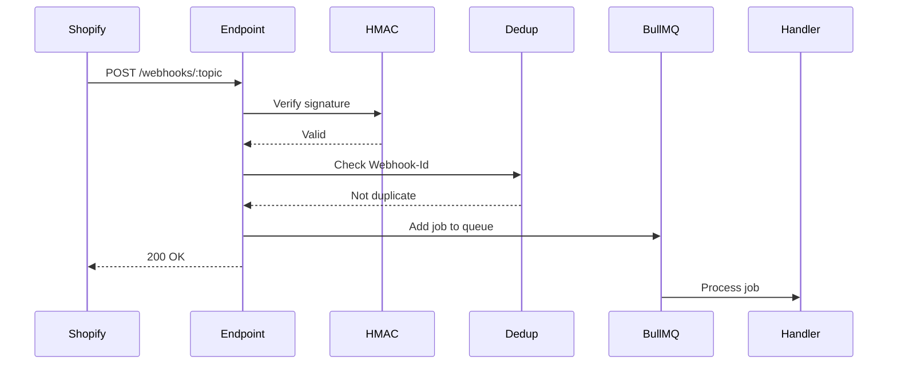

# Webhook Topics Reference - NEANELU Shopify Manager

> **Versiune:** 1.0 | **API:** 2025-10 | **Data:** 2025-12-26

---

## Registration

Webhook-urile sunt înregistrate automat la instalarea aplicației.
Configurația: `apps/backend-worker/src/webhooks/registry.ts`

---

## Supported Topics

### Products

| Topic             | Pri    | Queue         | Handler              |
| ----------------- | ------ | ------------- | -------------------- |
| `products/create` | Normal | sync.products | ProductCreatedHandler|
| `products/update` | Normal | sync.products | ProductUpdatedHandler|
| `products/delete` | High   | sync.products | ProductDeletedHandler|

**Payload Sample (products/update):**

```json
{
  "id": 123456789,
  "title": "Product Name",
  "status": "active",
  "updated_at": "2025-12-26T10:00:00Z"
}
```

---

### Collections

| Topic                | Pri    | Queue            | Handler                  |
| -------------------- | ------ | ---------------- | ------------------------ |
| `collections/create` | Normal | sync.collections | CollectionCreatedHandler |
| `collections/update` | Normal | sync.collections | CollectionUpdatedHandler |
| `collections/delete` | Normal | sync.collections | CollectionDeletedHandler |

---

### Inventory

| Topic                      | Prioritate | Coada     | Handler            |
| -------------------------- | ---------- | --------- | ------------------ |
| `inv_levels/update`        | Normal     | sync.inv  | InvUpdatedHandler  |
| `inv_levels/connect`       | Low        | sync.inv  | InvConnectedHandler|
| `inv_levels/disconnect`    | Low        | sync.inv  | InvDisconnHandler  |

---

### Orders

| Topic              | Pri    | Queue       | Handler               |
| ------------------ | ------ | ----------- | --------------------- |
| `orders/create`    | High   | sync.orders | OrderCreatedHandler   |
| `orders/updated`   | Normal | sync.orders | OrderUpdatedHandler   |
| `orders/cancelled` | High   | sync.orders | OrderCancelledHandler |
| `orders/fulfilled` | Normal | sync.orders | OrderFulfilledHandler |

---

### App Lifecycle

| Topic             | Pri      | Queue         | Handler               |
| ----------------- | -------- | ------------- | --------------------- |
| `app/uninstalled` | Critical | app.lifecycle | AppUninstalledHandler |
| `shop/update`     | Normal   | app.lifecycle | ShopUpdatedHandler    |

**CRITICAL: `app/uninstalled`**

- Trebuie să proceseze IMEDIAT
- Șterge toate datele shop-ului (GDPR compliance)
- Invalidează tokens
- Cleanup din toate cozile

---

### Customers (Extended - If Scopes Permit)

| Topic              | Pri    | Queue          | Handler                |
| ------------------ | ------ | -------------- | ---------------------- |
| `customers/create` | Low    | sync.customers | CustomerCreatedHandler |
| `customers/update` | Low    | sync.customers | CustomerUpdatedHandler |
| `customers/delete` | Normal | sync.customers | CustomerDeletedHandler |

---

## Processing Pipeline



---

## Deduplication

Shopify poate retrimite webhook-uri. Folosim deduplicare cu:

- **Redis Bloom Filter:** Verificare rapidă O(1)
- **X-Shopify-Webhook-Id:** Identificator unic per webhook
- **TTL:** 24 ore retention

```typescript
const isDuplicate = await bloomFilter.exists(webhookId);
if (isDuplicate) {
  return res.status(200).send('Already processed');
}
await bloomFilter.add(webhookId);
```

---

## Rate Limiting per Shop

| Window   | Max      | Action             |
| -------- | -------- | ------------------ |
| 1 minute | 1000     | Normal processing  |
| 1 minute | 1000-2000| Delayed processing |
| 1 minute | > 2000   | Throttle + alert   |

---

## Error Handling

### Retry Strategy

| Attempt | Delay       | Action           |
| ------- | ----------- | ---------------- |
| 1       | Immediate   | First try        |
| 2       | 30s         | First retry      |
| 3       | 2min        | Second retry     |
| 4       | 10min       | Third retry      |
| 5       | 1h          | Fourth retry     |
| 6+      | Move to DLQ | Dead Letter Queue|

### Dead Letter Queue (DLQ)

Failed webhooks go to `webhooks.failed` queue:

- Manual review required
- Auto-alert on DLQ size > 100
- Dashboard visible

---

## Headers Used

| Header                  | Description               |
| ----------------------- | ------------------------- |
| `X-Shopify-Topic`       | Webhook topic             |
| `X-Shopify-Hmac-Sha256` | HMAC signature            |
| `X-Shopify-Shop-Domain` | Shop domain               |
| `X-Shopify-Webhook-Id`  | Unique webhook ID         |
| `X-Shopify-API-Version` | API version used          |

---

## Monitoring

### Metrics Exported

- `webhook_received_total{topic, shop}` - Total received
- `webhook_processed_total{topic, status}` - Processed
- `webhook_processing_duration_seconds` - Processing time
- `webhook_dlq_size` - Dead letter queue size

### Alerts

| Condition              | Severity | Action                  |
| ---------------------- | -------- | ----------------------- |
| DLQ size > 100         | Warning  | Review failed webhooks  |
| Processing p99 > 5s    | Warning  | Investigate bottleneck  |
| Error rate > 5%        | Critical | On-call notification    |
| app/uninstalled fails  | Critical | Immediate investigation |
