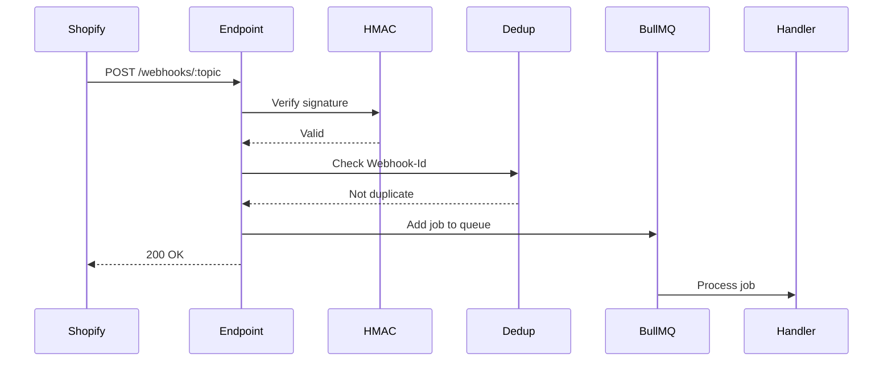

# Webhook Topics Reference - NEANELU Shopify Manager

> **Versiune:** 1.0 | **API:** 2025-10 | **Data:** 2025-12-26

---

## Registration

Webhook-urile sunt înregistrate automat la instalarea aplicației.
Configurația: `apps/backend-worker/src/webhooks/registry.ts`

---

## Supported Topics

### Products

| Topic             | Pri    | Queue          | Handler               |
| ----------------- | ------ | -------------- | --------------------- |
| `products/create` | Normal | webhook-queue  | ProductCreatedHandler |
| `products/update` | Normal | webhook-queue  | ProductUpdatedHandler |
| `products/delete` | High   | webhook-queue  | ProductDeletedHandler |

**Payload Sample (products/update):**

```json
{
  "id": 123456789,
  "title": "Product Name",
  "status": "active",
  "updated_at": "2025-12-26T10:00:00Z"
}
```

---

### Collections

| Topic                | Pri    | Queue         | Handler                  |
| -------------------- | ------ | ------------- | ------------------------ |
| `collections/create` | Normal | webhook-queue | CollectionCreatedHandler |
| `collections/update` | Normal | webhook-queue | CollectionUpdatedHandler |
| `collections/delete` | Normal | webhook-queue | CollectionDeletedHandler |

---

### Inventory

| Topic                           | Prioritate | Coada         | Handler               |
| ------------------------------- | ---------- | ------------- | --------------------- |
| `inventory_levels/update`       | Normal     | webhook-queue | InvUpdatedHandler     |
| `inventory_levels/connect`      | Low        | webhook-queue | InvConnectedHandler   |
| `inventory_levels/disconnect`   | Low        | webhook-queue | InvDisconnHandler     |

---

### Orders

| Topic              | Pri    | Queue         | Handler               |
| ------------------ | ------ | ------------- | --------------------- |
| `orders/create`    | High   | webhook-queue | OrderCreatedHandler   |
| `orders/updated`   | Normal | webhook-queue | OrderUpdatedHandler   |
| `orders/cancelled` | High   | webhook-queue | OrderCancelledHandler |
| `orders/fulfilled` | Normal | webhook-queue | OrderFulfilledHandler |

---

### App Lifecycle

| Topic             | Pri      | Queue         | Handler               |
| ----------------- | -------- | ------------- | --------------------- |
| `app/uninstalled` | Critical | webhook-queue | AppUninstalledHandler |
| `shop/update`     | Normal   | webhook-queue | ShopUpdatedHandler    |

**CRITICAL: `app/uninstalled`**

- Trebuie să proceseze IMEDIAT
- Șterge toate datele shop-ului (GDPR compliance)
- Invalidează tokens
- Cleanup din toate cozile

---

### Customers (Extended - If Scopes Permit)

| Topic              | Pri    | Queue         | Handler                |
| ------------------ | ------ | ------------- | ---------------------- |
| `customers/create` | Low    | webhook-queue | CustomerCreatedHandler |
| `customers/update` | Low    | webhook-queue | CustomerUpdatedHandler |
| `customers/delete` | Normal | webhook-queue | CustomerDeletedHandler |

---

## Processing Pipeline



---

## Deduplication

Shopify poate retrimite webhook-uri. Folosim deduplicare cu:

- **Redis Bloom Filter:** Verificare rapidă O(1)
- **X-Shopify-Webhook-Id:** Identificator unic per webhook
- **TTL:** 24 ore retention

```typescript
const isDuplicate = await bloomFilter.exists(webhookId);
if (isDuplicate) {
  return res.status(200).send('Already processed');
}
await bloomFilter.add(webhookId);
```

---

## Rate Limiting per Shop

| Window   | Max      | Action             |
| -------- | -------- | ------------------ |
| 1 minute | 1000     | Normal processing  |
| 1 minute | 1000-2000| Delayed processing |
| 1 minute | > 2000   | Throttle + alert   |

---

## Error Handling

### Retry Strategy

| Attempt | Delay | Action                |
| ------- | ----- | --------------------- |
| 1       | 0s    | First try (immediate) |
| 2       | 1s    | Retry #1              |
| 3       | 4s    | Retry #2              |

> **Policy (Source of Truth):** max **3 attempts**.
> Backoff schedule is **1s → 4s → 16s** (factor 4). Cu `max_attempts = 3`, doar primele două întârzieri sunt atinse.

### Dead Letter Queue (DLQ)

Failed webhooks go to `webhook-queue-dlq` queue:

- Manual review required
- Auto-alert on DLQ size > 100
- Dashboard visible

---

## Headers Used

| Header                  | Description               |
| ----------------------- | ------------------------- |
| `X-Shopify-Topic`       | Webhook topic             |
| `X-Shopify-Hmac-Sha256` | HMAC signature            |
| `X-Shopify-Shop-Domain` | Shop domain               |
| `X-Shopify-Webhook-Id`  | Unique webhook ID         |
| `X-Shopify-API-Version` | API version used          |

---

## Monitoring

### Metrics Exported

- `webhook_accepted_total{topic}` - Webhooks accepted
- `webhook_rejected_total{reason}` - Webhooks rejected
- `webhook_duplicate_total{topic}` - Deduplicated webhooks
- `webhook_processing_duration_seconds{topic}` - Ingress duration
- `queue_depth{queue_name}` - Jobs waiting (DLQ uses `queue_name="webhook-queue-dlq"`)

### Alerts

| Condition              | Severity | Action                  |
| ---------------------- | -------- | ----------------------- |
| DLQ size > 100         | Warning  | Review failed webhooks  |
| Processing p99 > 5s    | Warning  | Investigate bottleneck  |
| Error rate > 5%        | Critical | On-call notification    |
| app/uninstalled fails  | Critical | Immediate investigation |

---

## Quality Events (Outbound)

Aceste webhook-uri NU vin de la Shopify; sunt trimise de aplicație către endpoint-ul configurat în `Settings > Webhooks`.

### Event Types

| Event                  | Descriere                                              |
| ---------------------- | ------------------------------------------------------ |
| `quality_promoted`     | Produs promovat (`bronze->silver`, `silver->golden`) |
| `quality_demoted`      | Produs retrogradat                                     |
| `review_requested`     | Produs marcat pentru review                            |
| `milestone_reached`    | Milestone de produse `golden` atins                    |

### Payload

```json
{
  "event_type": "quality_promoted",
  "event_id": "uuid",
  "product_id": "uuid",
  "sku": "SKU-123",
  "previous_level": "bronze",
  "new_level": "silver",
  "quality_score": 0.91,
  "trigger_reason": "match_confirmed",
  "timestamp": "2026-02-13T10:00:00.000Z",
  "shop_id": "uuid"
}
```

### Delivery guarantees

- Eventul este trimis doar după persistarea în DB (`prod_quality_events`)
- fiecare attempt este logat în `quality_webhook_deliveries`
- evenimentele non-livrabile rămân retry-abile manual
- sweep scheduler re-procesează pending events la 5 minute, cu limită de vârstă configurabilă
