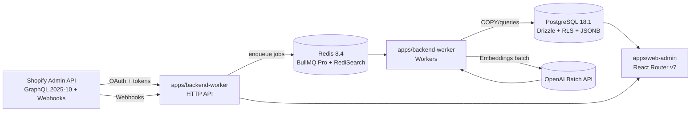
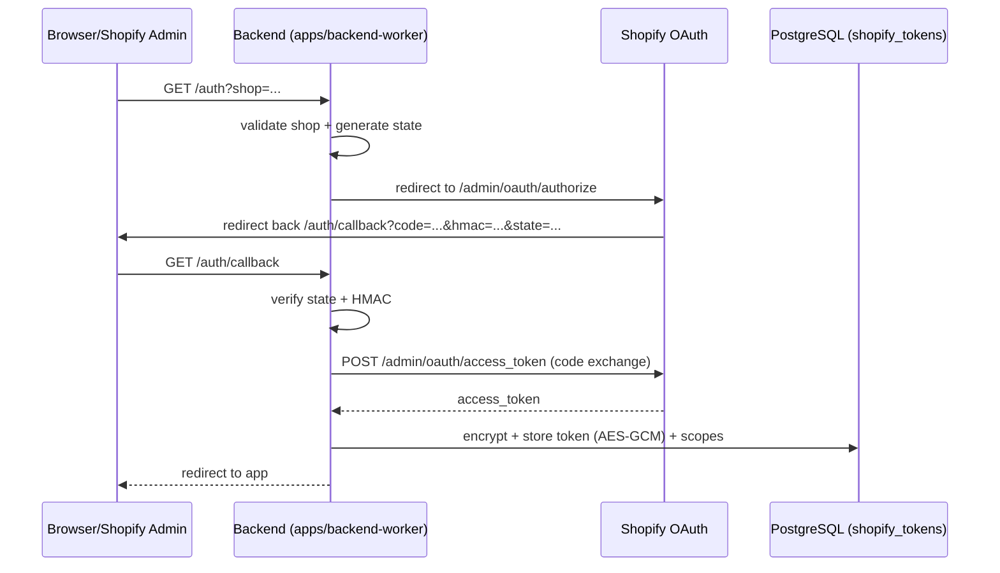

# Neanelu_Shopify

Aplicație Shopify (Enterprise/1M+ SKU) + un set de scripturi de **research** (Python și TypeScript) validate practic pentru:

- acces Admin GraphQL (Shopify Admin API `2025-10`)
- export Bulk Operations (JSONL) și procesare streaming
- sampling determinist vendor/produs (reproductibil, fără random)
- „TOT / fetch everything” pentru `Product` prin schema introspection + paginare completă

Repo-ul este în acest moment dominat de documentație (planuri) și de zona de research care a validat constrângeri reale ale Shopify Admin API.

## Cuprins

- [1. TL;DR](#1-tldr)
- [2. Status repo: „target-state” vs „starea curentă”](#2-status-repo-target-state-vs-starea-curentă)
- [3. Descoperiri validate (research)](#3-descoperiri-validate-research)
- [4. Diagrame (procese cheie)](#4-diagrame-procese-cheie)
- [5. Rulare research (pnpm-only pentru TypeScript)](#5-rulare-research-pnpm-only-pentru-typescript)
- [6. Igienă & securitate (foarte important)](#6-igienă--securitate-foarte-important)
- [7. Documentația repo-ului](#7-documentația-repo-ului)
- [8. Direcția de implementare (high-level, pe faze)](#8-direcția-de-implementare-high-level-pe-faze)

## 1. TL;DR

- Stack țintă (conform Docs): **Node.js v24 LTS**, **PostgreSQL 18.1**, **Redis 8.4**, **BullMQ Pro**, monorepo **pnpm**.
- Pentru volume mari (100k–1M+ produse), **Bulk Operations** + pipeline **streaming** este obligatoriu; JSONL-ul nu poate fi încărcat în RAM.
- Exportul Bulk Ops produce entități separate (Product/Variant etc). Legarea se face prin `__parentId` ⇒ ingestia trebuie să facă „stitching”.
- Pentru a „citi tot ce se poate” despre un produs, am validat un „everything fetch” bazat pe **schema introspection**, cu **paginare completă** pentru conexiuni precum `metafields`.
- Metafield-urile app-owned (`app--<id>--...`) pot fi invizibile în afara contextului aplicației owner (limitare Shopify).
- TypeScript research rulează **exclusiv cu pnpm**: `pnpm exec tsx ...`.

## 2. Status repo: „target-state” vs „starea curentă”

### 2.1 Starea curentă

Repo-ul conține:

- `Docs/` – arhitectură + planuri (target-state)
- `Plan_de_implementare.md` – plan detaliat pe faze (F0–F7), incluzând un addendum cu descoperirile validate în research
- `Research Produse/` – scripturi și notițe pentru export Bulk + Admin GraphQL

`README.md` (acest fișier) este sinteza consolidată.

### 2.2 Target-state (conform Docs)

Ținta este un monorepo cu `apps/*` și `packages/*`, aproximativ:

- `apps/backend-worker` – API (OAuth, webhooks) + workers (Bulk ingest, AI)
- `apps/web-admin` – UI embedded (React Router v7)
- `packages/*` – DB, Shopify client, queue-manager, config, logger, types, AI engine

Detaliile sunt în `Docs/Structura_Proiect_Neanelu_Shopify.md`.

## 3. Descoperiri validate (research)

Aceste puncte sunt „facts on the ground” (nu doar teorie) și trebuie tratate ca restricții de proiectare.

### 3.1 Auth Admin GraphQL în mediu headless

- În medii headless Linux/Ubuntu, Shopify CLI login poate fi instabil/blocat.
- Pentru research s-a folosit un flow OAuth manual (captură `code` + exchange la `/admin/oauth/access_token`).

Implicație: produsul final trebuie să aibă **OAuth server-side complet** (start/callback + state/HMAC) și să persiste token-uri criptat în DB; CLI rămâne doar „DX convenience”, nu o dependență.

### 3.2 Bulk Operations JSONL: format și relații

- Exportul Bulk Ops produce fișier JSONL masiv (sute de MB / milioane de linii).
- Entitățile (ex. `Product` și `ProductVariant`) pot apărea pe linii separate.
- Relația variant → product este exprimată prin câmpul `__parentId`.

Implicație: ingestia trebuie să fie streaming-first și să facă **stitching** folosind `__parentId`.

### 3.3 Determinism pentru debugging/parity

Pentru a compara pipeline-uri și a reproduce exact aceleași rezultate:

- vendorii se aleg determinist (de ex. „alphabet buckets” A–Z + #)
- pentru fiecare vendor ales se iau primele N produse în ordinea apariției în JSONL

Implicație: eliminăm „random drift” din debugging și din comparațiile Python vs TypeScript.

### 3.4 „TOT / fetch everything” pentru Product

S-a validat o abordare robustă:

- schema introspection ⇒ enumerăm câmpurile tipului `Product`
- generăm query stabil (versiune Admin API `2025-10`)
- paginăm conexiuni mari (în special `metafields`) până la epuizare
- raportăm explicit contează: `metafieldsCountFetched`, `variantsCountFetched`

Implicație: nu ne bazăm pe „hardcoded fields” care se degradează când Shopify schimbă schema.

### 3.5 Limitare importantă: app-owned metafields

- namespace-urile `app--<id>--...` pot fi vizibile doar în contextul aplicației owner.
- un token de staff/Admin (sau alt app) poate vedea rezultate goale.

Implicație: „fetch all metafields” nu garantează acces la date app-owned; dacă sunt critice, trebuie citite/persistate de aplicația care le deține.

## 4. Diagrame (procese cheie)

### 4.1 Flux „target-state” (high-level)



### 4.2 Flux research: Bulk JSONL → sampling → Product “TOT”

```mermaid
flowchart TD
  Bulk[Bulk Operations export\nJSONL foarte mare] --> StreamParse[Stream parse JSONL\n(memorie constantă)]
  StreamParse --> Stitch[Stitch Product/Variant\nprin __parentId]
  Stitch --> Sample[Sampling determinist\n(A-Z + #, primele N produse)]
  Sample --> Fetch[Admin GraphQL fetch\nProduct "TOT" (introspection)]
  Fetch --> Paginate[Paginate connections\nex: metafields]
  Paginate --> Outputs[Artefacte JSON\n(Research Produse/TSOutputs)]
```

### 4.3 OAuth server-side (flow de producție)



### 4.4 Bulk ingest „stitched” (concept)

```mermaid
flowchart LR
  URL[Signed URL (Bulk result)] --> DL[HTTP download stream]
  DL --> Parse[JSONL line parsing]
  Parse --> Transform[Normalize rows\n+ extract ids]
  Transform --> Stitch[Relate children via __parentId]
  Stitch --> Copy[Postgres COPY FROM STDIN\n(pg-copy-streams)]
  Copy --> PG[(PostgreSQL 18.1)]
```

### 4.5 Multi-tenant fairness (BullMQ Pro Groups) + rate limiting

```mermaid
flowchart TD
  Jobs[Jobs: webhook/sync/bulk] --> Grouping[GroupId = shop_id (UUID)]
  Grouping --> RR[Round-robin between groups]
  RR --> Limiter[Per-shop concurrency\n+ rate limit]
  Limiter --> Worker[Worker executes job]
  Worker -->|Shopify API calls| Budget[Token bucket / cost budget]
  Budget -->|ok| Worker
  Budget -->|throttled| Delay[Delay only this group]
```

## 5. Rulare research (pnpm-only pentru TypeScript)

### 5.1 Prerequisites

- Node.js (ideal conform `.nvmrc`)
- pnpm (corepack)

### 5.2 TypeScript research (TScripts)

Instalare (în folderul TScripts):

```bash
cd /var/www/Neanelu_Shopify/Research Produse/Scripts/TScripts
pnpm install
```

Sampling determinist vendor/produs (din JSONL):

```bash
pnpm exec tsx sample_by_vendor.ts /var/www/Neanelu_Shopify/Research Produse/bulk-products.jsonl \
  --k 3 \
  --alphabet-pick \
  --alphabet ABCDEFGHIJKLMNOPQRSTUVWXYZ# \
  --out /var/www/Neanelu_Shopify/Research Produse/TSOutputs/vendor_samples_report.json
```

Fetch Product details „TOT / everything”:

```bash
pnpm exec tsx fetch_shopify_products.ts \
  --env /var/www/Neanelu_Shopify/Research Produse/.env.txt \
  --report /var/www/Neanelu_Shopify/Research Produse/TSOutputs/vendor_samples_report.json \
  --vendor-count 10 \
  --vendor-pick-mode report-order \
  --everything \
  --paginate-variants \
  --out-details /var/www/Neanelu_Shopify/Research Produse/TSOutputs/products_TOT_10x3.json
```

Notă: toate secretele rămân locale și nu se comit.

### 5.3 Python research (opțional)

În `Research Produse/Notes/README.md` există exemple de comenzi pentru scripturile Python (sampling/fetch).

## 6. Igienă & securitate (foarte important)

- Nu comite niciodată token-uri, shared secrets, fișiere `.env*` cu valori reale.
- Fișierele foarte mari (Bulk JSONL, outputs generate) trebuie tratate ca artefacte și ignorate în Git.
- Constrângere confirmată: GitHub Push Protection poate bloca push-ul dacă detectează secrete în history.

Recomandare de practică:

- păstrează `.env.example` cu placeholders (pentru onboarding)
- ține valorile reale în secret manager (în target-state: OpenBAO) sau local (doar pentru research)

## 7. Documentația repo-ului

- `Plan_de_implementare.md` – plan final pe faze (F0–F7) + addendum research (TypeScript)
- `Docs/DevOps_Plan_Implementare_Shopify_Enterprise.md` – plan DevOps target-state (infrastructure-first)
- `Docs/Stack Tehnologic Complet pnpm Shopify.md` – decizii de stack + versiuni + motivare pnpm
- `Docs/Strategie_dezvoltare.md` – blueprint tehnologic (arhitectură și pipeline-ul stitched)
- `Docs/Plan Implementare Aplicatie Completa.md` – arhitectură generală și faze (numerotare diferită)
- `Docs/Structura_Proiect_Neanelu_Shopify.md` – structura „target-state” + notă despre starea curentă (research)
- `Research Produse/Notes/README.md` – notițe/entrypoint pentru research
- `Research Produse/Scripts/TScripts/README.md` – cum se rulează TScripts

## 8. Direcția de implementare (high-level, pe faze)

Pe scurt, ca să trecem de la research la produs:

1. Bootstrapping monorepo „real” (dacă nu e deja) + ESM contract + tooling CI
2. Data layer: schema PostgreSQL (uuidv7), RLS, migrații Drizzle, seed deterministic
3. Backend HTTP: OAuth server-side complet + webhooks ingress (HMAC + enqueue)
4. Async engine: BullMQ Pro Groups + fairness + rate limiting per shop
5. Bulk pipeline stitched: streaming JSONL → stitching → COPY (observabilitate și hardening)
6. AI: embeddings batch + vector search Redis
7. Producție: CI/CD, observabilitate completă, runbooks, DR

Detaliile complete (și task-urile granular) sunt în `Plan_de_implementare.md`.
